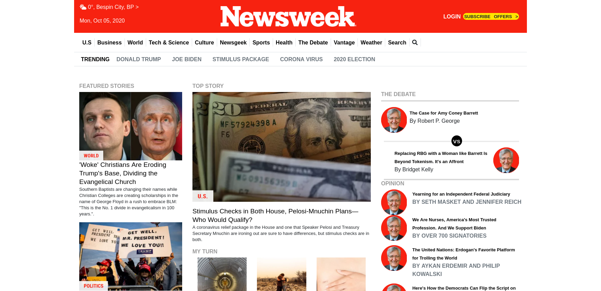

# NEWSWEEK PAGE USING BOOTSTRAP 

Smashing Magazine copy using gray heat map to show hierarchy of elements

## Built With

- HTML
- CSS
- Bootstrap

## Live Demo

[Live Demo Link](https://alejandrotoledoweb.github.io/news-week/)

## Getting Started

To get a local copy up and running follow these simple example steps.

### Prerequisites

- A operating system such as Windows, MAC, or Linux
- A modern browser such as Google Chrome, Mozilla Firefox, or Microsoft Edge

### Setup
- Clone or download the repo and run the HTML File.

### Run tests
- [We use Stylelint, Lighthout, & Webhint](https://github.com/alejandrotoledoweb/news-week/actions/runs/292426741)
- Linters #8

## Authors

👤 **Author1**

- GitHub: [@alejandrotoledoweb](https://github.com/alejandrotoledoweb)
- Twitter: [@alejot](https://twitter.com/alejot)
- LinkedIn: [LinkedIn](https://www.linkedin.com/in/alejandro-toledo-3b444b109/)

👤 **Author2**

- GitHub: [@thneves](https://github.com/thneves)
- Twitter: [@Rthales-neves10](https://www.linkedin.com/in/thales-neves10/)
- LinkedIn: [Thales Neves](https://twitter.com/tsneves11)

## 🤝 Contributing

Contributions, issues, and feature requests are welcome!

Feel free to check the [issues page](https://github.com/alejandrotoledoweb/news-week/issues).

## Show your support

Give a ⭐️ if you like this project!

## 📝 License

N/A# TNW-Clone
